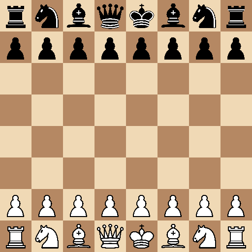

# ChessGame

Chess application in C++ using SFML



## Current features

- A 512 × 512 pixel board with 64 × 64 squares.
- All 32 pieces in their starting positions, using PNG textures.
- Selection of a piece by clicking its square; its type is printed as a numeric value in the terminal.

Piece movement, legal-move validation, turns, captures and check detection are not implemented yet. Selection has no visual highlight.

## Build and run

Requires `g++`, `make` and **SFML 2.x**. The code uses the SFML 2 API.

On Ubuntu 24.04:

```bash
sudo apt-get update
sudo apt-get install build-essential libsfml-dev
git clone https://github.com/PSGui/ChessGame.git
cd ChessGame
make
./chess
```

Run from the repository root so the application can load the images in `assets/`. A graphical display is required.

| Command | Purpose |
| --- | --- |
| `make` | Build the `chess` executable. |
| `make run` | Build and launch the application. |
| `make clean` | Remove object files. |
| `make fclean` | Also remove the executable. |
| `make re` | Clean and rebuild. |

Click an occupied square to select a piece. Close the window to exit.

## Files

| File | Purpose |
| --- | --- |
| [`src/main.cpp`](src/main.cpp) | Window creation, event handling and rendering loop. |
| [`src/board.cpp`](src/board.cpp) | Initial position, texture loading and board rendering. |
| [`src/game.cpp`](src/game.cpp) | Piece selection from mouse coordinates. |
| [`include/`](include/) | Board and game declarations, piece types and colours. |
| [`assets/`](assets/) | PNG textures for the six piece types in both colours. |

## Verification

Compiled with GCC and SFML 2.6.1 on Linux. The image above is a capture of the running application on a virtual display, with no changes to the game source.
